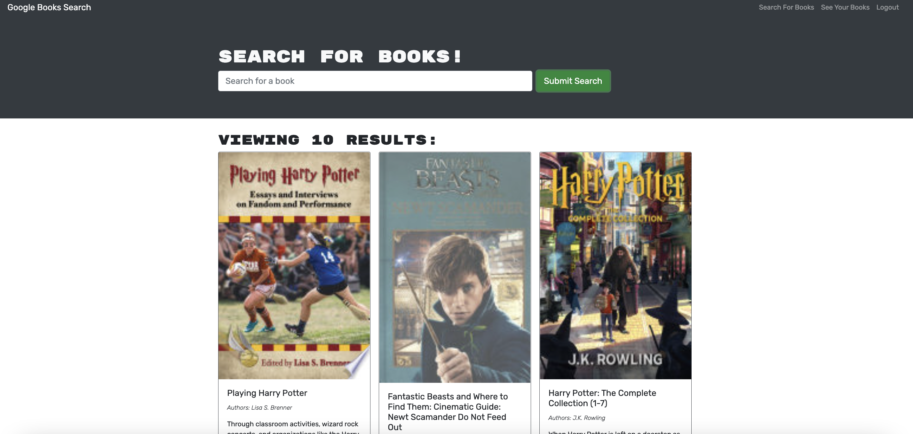
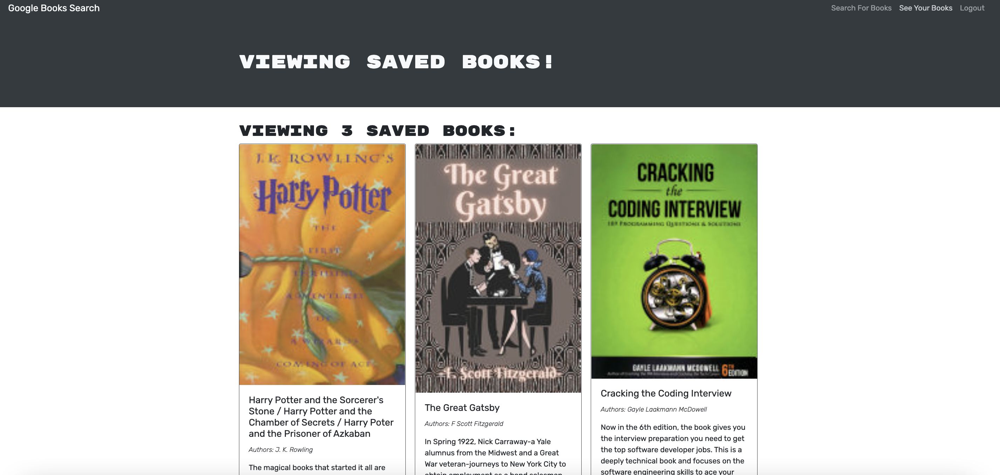

# Google Books Search Engine

## Description
This project was refactored from starter code for a search engine that used RESTful API techniques to manage data.  The goal was to implement GraphQL API with an Apollo Server to search for books, save books, and delete saved books.  A user must signup/login to save books.  This application is built using the MERN stack (React front end, MongoDb database, Node.js, Express.js).

* Uses json web tokens (jwt) for authentication.

## Deployed Application
https://mysterious-temple-45988.herokuapp.com/

## Installation
To access the application locally:

Install dependencies by running `npm i` in the command line of the root directory.

Use `npm run develop` to concurrently run the servers.  Then view the page at localhost:3000

## Screenshots

 

 

## Contributions
Developed by Chris Hodges

## Questions
For any questions, contact me at chrisdhodges12@gmail.com or find me on GitHub at https://github.com/chrisdhodges12

